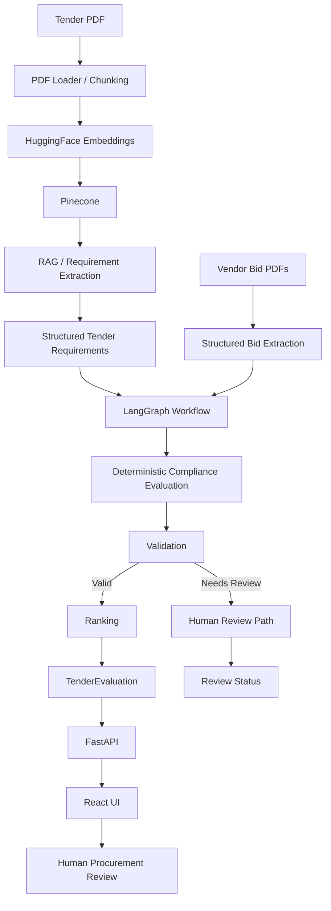

# Tender Bid Evaluation System

Tender Bid Evaluation System turns a tender PDF and vendor bid PDFs into a structured, auditable comparison. It combines LLM-based document understanding with deterministic Python compliance rules, LangGraph workflow orchestration, a FastAPI API, and a React review interface. The system provides decision support; it does not autonomously award a tender.

## Overview

The system extracts procurement requirements from `data/tender.pdf`, accepts vendor submissions from `bids/`, and evaluates each bid against quantity, technical specification, warranty, and delivery requirements. Compliant bids are ranked by price so procurement officials can review the recommended L1 bid alongside the underlying checks and failure reasons.

The final procurement decision remains with the authorized human procurement authority.

## Tech Stack

- Python 3.13
- LangChain — document processing, embeddings, and structured LLM interactions
- LangGraph — stateful workflow orchestration and conditional routing
- OpenAI — LLM-based document understanding
- HuggingFace / Sentence Transformers — text embeddings
- Pinecone — vector storage and semantic retrieval
- Pydantic — structured data models and validation
- FastAPI — backend API
- React + Vite — frontend
- Pytest — automated testing

## Key Features

- Tender PDF loading, chunking, and structured requirement extraction.
- Retrieval-augmented generation using HuggingFace embeddings and Pinecone.
- Structured vendor bid extraction from multiple PDF files.
- Deterministic Python compliance evaluation.
- L1/L2/L3 ranking of compliant bids by price.
- LangGraph workflow orchestration with explicit state and conditional routing.
- Validation and a human-review path for unsafe or unrankable evaluations.
- FastAPI endpoints for health checks and bid evaluation.
- React UI for uploads, summaries, rankings, checks, and failure reasons.
- Automated pytest coverage for evaluator, ranking, and graph behavior.

## Architecture



The responsibilities are deliberately separated:

- **LLM-based document understanding:** tender and bid PDFs are converted into structured Pydantic models.
- **Deterministic Python business rules:** compliance and price ranking are evaluated without asking the LLM to make procurement decisions.
- **Workflow orchestration:** LangGraph passes structured state through extraction, evaluation, validation, ranking, and review/error paths.

## End-to-End Flow

1. Upload tender and vendor bid PDFs.
2. Extract structured tender and bid information.
3. Retrieve relevant tender context through the RAG pipeline.
4. Evaluate bid compliance using deterministic Python rules.
5. Validate the evaluation through LangGraph.
6. Rank compliant bids by price.
7. Return the evaluation through FastAPI.
8. Display the result in the React review interface.
9. Human procurement authority makes the final decision.

## LangGraph Workflow

The current graph in `src/graph.py` contains these nodes:

1. `extract_tender`
2. `process_bids`
3. `evaluate_bids`
4. `validate_evaluation`
5. `rank_bids`
6. `human_review`
7. `error`

The normal path is:

```text
START -> extract_tender -> process_bids -> evaluate_bids
			 -> validate_evaluation -> rank_bids -> END
```

Validation routes valid evaluations to `rank_bids`, evaluations requiring business review to `human_review`, and operational failures to `error`. A vendor failing a compliance check is expected business data, not a workflow error. If no compliant bids exist, the graph ends with a `needs_human_review` status instead of fabricating a recommendation.

## RAG Pipeline

The tender processor performs the following steps:

1. Load the tender with `PyPDFLoader`.
2. Split the document into chunks using `chunk_size=500` and `chunk_overlap=50`.
3. Generate embeddings with `sentence-transformers/all-MiniLM-L6-v2`.
4. Store and retrieve vectors through the Pinecone index `tender-rag`.
5. Retrieve relevant tender context for questions.
6. Use the OpenAI chat model for answers and structured requirement extraction.

The current embedding dimension is 384. Structured tender requirements are extracted from the complete tender context in the tender processor; the RAG question-answering path separately retrieves relevant chunks and displays sources.

## Compliance Evaluation

Compliance is intentionally deterministic and implemented in Python in `src/evaluator.py`. Current checks include:

- **Quantity:** required quantity plus the extracted tolerance range.
- **Technical specification:** identifier-based matching of the primary specification and ALT identifiers.
- **Warranty:** offered warranty months must meet the tender requirement.
- **Delivery:** the offered date must be on or before the tender completion date.

Procurement compliance should be auditable and repeatable. Keeping these rules outside the LLM reduces variability and makes each pass/fail decision explainable.

## Ranking

The ranking layer:

- excludes non-compliant bids;
- sorts compliant bids by price;
- assigns the lowest compliant price as L1;
- assigns subsequent compliant bids as L2, L3, and so on;
- uses the current lowest compliant bid as the recommendation.

The recommendation is advisory. Final award authority remains with a human procurement official.

## API

Start the FastAPI application and use the following endpoints:

### `GET /health`

Returns a simple service health response:

```json
{"status": "ok"}
```

### `POST /evaluate`

Accepts multipart form data with one required tender PDF and up to four optional bid PDFs:

- `tender`
- `bid1`
- `bid2`
- `bid3`
- `bid4`

At least one bid is required. The endpoint validates PDF uploads, writes them to temporary files, runs the LangGraph workflow, and removes the temporary files after processing.

Response shape:

```json
{
	"tender": {},
	"bid_evaluations": [],
	"ranked_bids": [],
	"recommended_bid": {}
}
```

## Frontend

The React UI in `frontend/` calls the FastAPI endpoint and displays:

- tender summary;
- recommended bid;
- compliant ranking;
- detailed checks for every bid;
- clear reasons for non-compliant bids.

## Project Structure

```text
tender-rag/
├── src/
├── frontend/
├── bids/
├── data/
├── tests/
├── requirements.txt
├── .gitignore
└── README.md
```

Important backend modules:

- `models.py`: Pydantic models including `TenderRequirements`, `Bid`, `ComplianceCheck`, `BidEvaluationReport`, and `TenderEvaluation`.
- `config.py`: environment loading, paths, model names, and API-key checks.
- `tender_processor.py`: tender PDF loading, chunking, embeddings, Pinecone upload, retrieval setup, and requirement extraction.
- `rag.py`: retrieval-based question answering and source display.
- `bid_processor.py`: vendor bid PDF loading and structured extraction.
- `evaluator.py`: deterministic compliance checks.
- `ranking.py`: compliant-bid filtering and price sorting.
- `application.py`: application-level evaluation and ranking composition.
- `graph.py`: LangGraph state, nodes, conditional routing, and compiled workflow.
- `api.py`: FastAPI application and upload endpoint.
- `main.py`: command-line orchestration and result display.

Tests:

- `test_evaluator.py`: deterministic compliance cases.
- `test_ranking.py`: filtering and price ordering.
- `test_graph.py`: validation, routing, and an offline graph workflow.

## Setup

The following commands use Windows PowerShell and Python 3.13:

```powershell
& "C:\Users\merci\AppData\Local\Programs\Python\Python313\python.exe" -m venv .venv313
.\.venv313\Scripts\Activate.ps1
python -m pip install -r requirements.txt
```

Create a local `.env` file with the required environment variables. The application loads environment variables with `python-dotenv`. Do not put real API keys in this README or commit them to source control.

The tender PDF should be at `data/tender.pdf`, and vendor PDFs should be placed in `bids/`.

## Running the Backend

From the repository root:

```powershell
.\.venv313\Scripts\python.exe -m uvicorn src.api:app --reload
```

The API is available at `http://127.0.0.1:8000`. Swagger documentation is available at `http://127.0.0.1:8000/docs`.

The command-line workflow can also be run with:

```powershell
.\.venv313\Scripts\python.exe src/main.py
```

## Running Tests

```powershell
.\.venv313\Scripts\python.exe -m pytest -q
```

The current suite contains 17 tests. The tests exercise deterministic logic and mock graph extraction boundaries where appropriate, so they do not unnecessarily depend on live OpenAI or Pinecone calls.

## Running the Frontend

```powershell
cd frontend
npm install
npm run dev
```

The Vite development server runs at `http://127.0.0.1:5173` by default. Other supported commands are:

```powershell
npm run build
npm run preview
```

Run the backend and frontend in separate terminals.

## Example Evaluation

Using the current sample tender and four sample bid PDFs, the verified result is:

```text
L1: Bharat Electricals Ltd
L2: ABC Engineering Pvt Ltd
Recommended: Bharat Electricals Ltd
```

National Switchgear Corp is non-compliant because its quantity of 250 is below the allowed minimum of 251.75. Delta Industrial Systems is non-compliant because its technical specification does not match the required identifiers.

## Design Decisions

### Why RAG?

RAG retrieves relevant tender context from document content for focused question answering and source display.

### Why structured output?

Structured output converts unstructured tender and bid documents into predictable Pydantic models that the rest of the pipeline can validate and use.

### Why deterministic compliance?

Procurement rules should be auditable, repeatable, and less susceptible to LLM variability. Python owns the pass/fail decisions and price ranking.

### Why LangGraph?

LangGraph represents the multi-step workflow with explicit state, named nodes, and conditional routing for valid, review-required, and error outcomes.

### Why FastAPI?

FastAPI exposes the evaluation workflow as a multipart API that the frontend can call.

### Why React?

React provides an interactive review interface for uploaded documents, rankings, compliance checks, and recommendation details.

## Limitations

- The repository contains sample/demo tender and bid data.
- Technical matching is identifier-based rather than a complete semantic equivalence engine.
- Human procurement approval is still required.
- The full pipeline depends on external OpenAI, HuggingFace model, and Pinecone services.
- Production authentication, authorization, audit logging, and enterprise security still need to be added.

## Future Improvements

- Persistent LangGraph checkpoints.
- Human-in-the-loop approval workflows.
- Stronger technical specification matching.
- Evaluation and observability instrumentation.
- Authentication and authorization.
- Audit logging.
- Production deployment.
- More comprehensive test coverage.
- Support for larger tender document sets.

## Testing

The current deterministic test suite has 17 passing tests. It validates compliance rules, ranking behavior, graph validation, conditional routing, and the expected sample ranking without unnecessarily relying on live LLM or vector-database calls.

## Interview Talking Points

- Why use RAG for tender documents?
- Why use Pinecone for vector retrieval?
- Why use structured output instead of free-form LLM responses?
- Why use LangGraph for orchestration?
- Why should the LLM not decide L1 ranking?
- How does the workflow handle no compliant bids?
- How would you productionize authentication, auditability, and observability?
